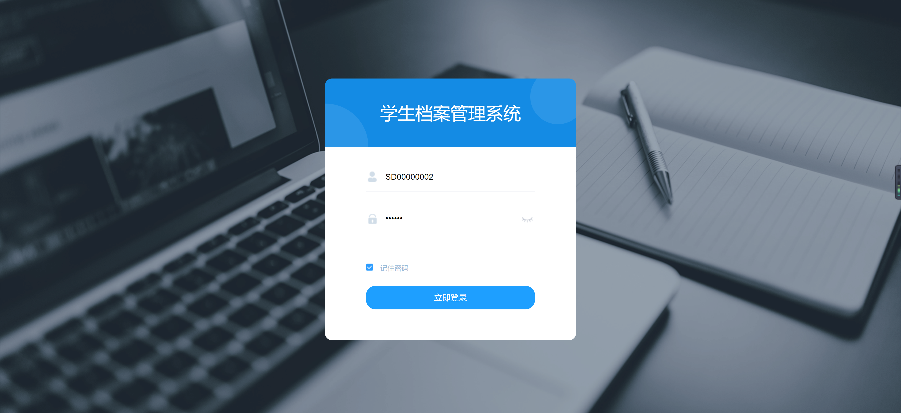
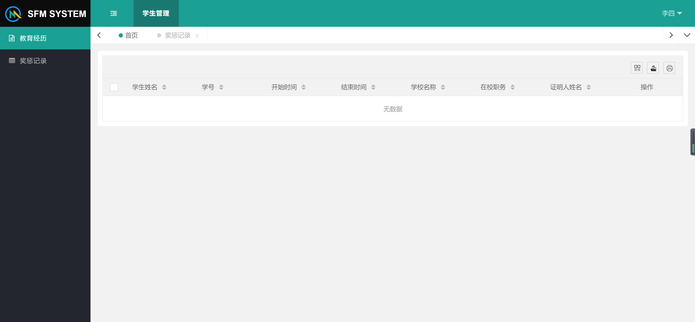
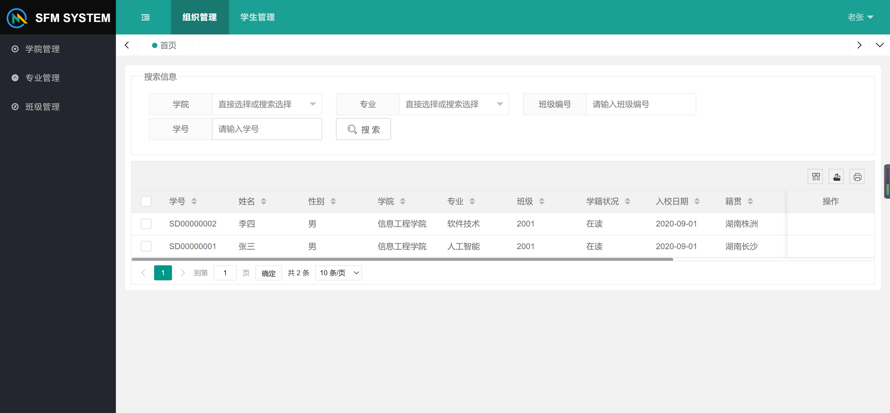
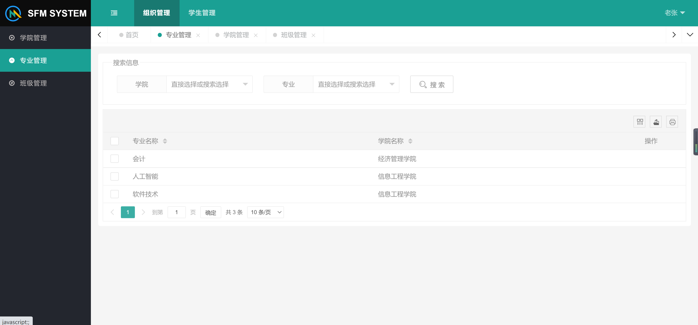
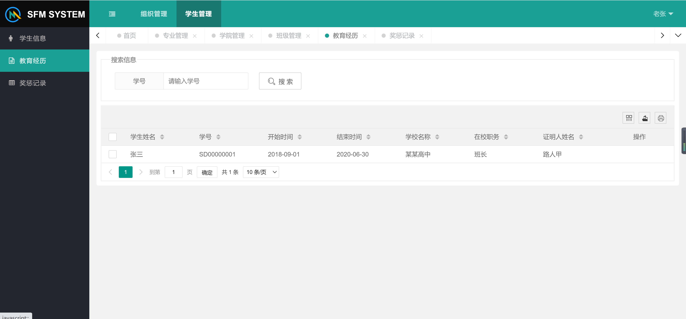

<h1 align="center">学生档案管理系统</h1>

## 简介
学生档案管理系统：提供管理员和用户两种角色，拥有教育经历管理、奖惩记录管理、专业管理、学生信息管理、登录等功能，界面设计简洁，支持高效信息查询和管理。    --计算机毕业设计源码；毕设源码；java毕业设计源码

## 联系方式

<h3 align="center">获取完整代码与数据库文件 + 微信：deepguan QQ: 86050149 QQ群: 783742310</h3>

<h3 align="center">可帮忙远程部署 包运行成功！提供远程部署、修改代码、设计文档指导、代码讲解等服务！</h3>

## 功能介绍（完整见运行截图）
管理员：该系统支持登录界面输入学号或用户名及密码，提供“记住密码”选项。导航栏可管理学院、专业、班级，专业管理界面支持专业信息搜索、导出及打印。用户还可查看学生信息，包括学籍状态、入校日期等，并通过搜索栏筛选。管理员还能够管理学生的教育经历与奖惩记录，通过分页与条数选择方便切换不同页信息。

学生：用户可通过登录界面输入学号或用户名及密码进入系统，选择“记住密码”以便下次自动登录。在查看学生信息时，能根据学院、专业、学号和班级编号使用搜索栏过滤信息。学生可查看自己的教育经历信息，以及查询奖惩记录，尽管奖惩记录页面当前无数据。教育经历页面展示学号、教育时间、学校名称等信息，便于学生了解自己的历史记录。

## 运行截图

本代码来源于网络,仅供学习参考使用!

